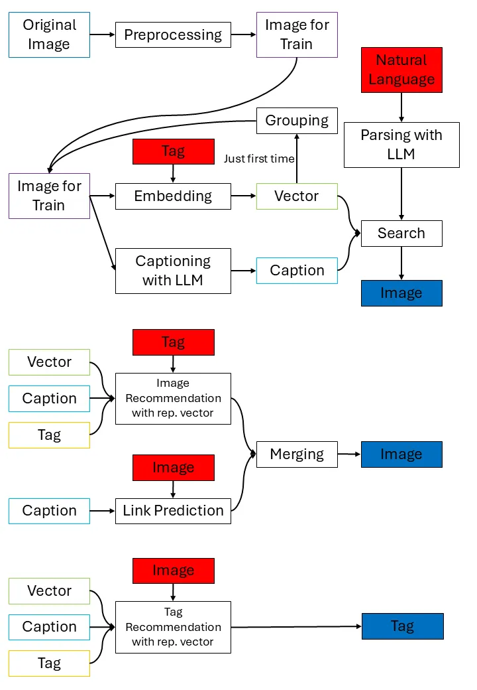

# Iteration 2 Working Demo

## MomenTag application

MomenTag android application and backend API server are implemented.

### Implemented features

- Authentication; sign up, sign in, sign out, refresh token
- Image upload after allow access
- Image search using natural language query
- Browsing search result

### Getting started

#### Prerequisite

**The backend server is not deployed on cloud. You have to run local server instance.**

This demo uses

- `uv` for dependency management
- `docker, docker-compose` for running local services

Install above tools properly.

Also, this demo targets python >= 3.13. If necessary, install appropriate version with uv.

#### Running demo

After tool installation, modify line 89 of `ApiService.kt`, line 77 of `TokenAuthenticator.kt` on android code to match your local server IP.

Since this demo version supports only HTTP endpoints, test on local network.

**Avoid exposing the backend server on the internet directly**

Furthermore, if you want to test with more images, feel free to modify line 75 of `LocalRepository.kt` to increase numbers of images uploaded.

```bash
# Following commands are executed in backend dir
cd backend

# Sync dependencies
uv sync

# Set env variables
export SECRET_KEY="$YOUR_SECRET_KEY"
export QDRANT_CLIENT_URL="http://localhost:6333"
export QDRANT_API_KEY="dummy_API_KEY"
export DJANGO_ALLOWED_HOSTS="$YOUR_IP_ADDRESS"

# Run local qdrant, redis container
docker-compose up -d

# Run local celery workers (terminal 1)
uv run celery -A config worker -l info

# Run local backend server (terminal 2)
uv run manage.py runserver 0.0.0.0:8000
```

Build android application and install it.

Run MomenTag application to test features.

### Demo video
[Video link](https://drive.google.com/file/d/1-6WRDJ-fuZy076SFj3R4GLgSUBKUwjqL/view?usp=sharing)

## Tag search PoC

We've written functions that implement the MomenTag app's features. They were written in proof-of-concept form, and will be applied to the frontend and backend appropriately in subsequent iterations.

It consists of three types of functions.

- Preprocessing: reduce file number
- NL Search: output photos appropriate to the query
- Image Recommendation: recommend images that match the image set
- Tag Recommendation: recommend tags that match the image

### Architecture diagram



### Getting started

Image data is required. The data set is on the GPU server. If you want to run it, you must run it on the GPU server.

The command is run from within the tag-search folder

- NL Search

    `uv run ./NL_Search/search.py <query_text> # (e.g. "play room escape and take a photo")`

- Image Recommendation

    `uv run ./Image_Recommendation/image_recommend.py <tag_name>`

- Tag Recommendation

    `uv run ./Tag_Recommendation/tag_recommend_with_rep_vec.py <image_id.jpg> # (e.g. 20230429_165859.jpg)`

### Measure and Results

- Grouping

    measure: numer of iamges

    result: 1837 images → 1128 images

- Captioning with LLM

    measure: speed

    result: 1200 images / 30 second

- Image Recommendation with rep. vector

    measure: using coco data set

    result: accuracy is 90% for one tag, but only about 10-30% of photos can be found

- Link Prediction

    measure: human judgment

    result: top 70 - roughly 10% noise due to incomplete tagging info

- Tag Recommendation with rep. vector

    measure: using coco data set

    result: accuracy is 90% for one tag, but only about 10-30% of photos can be found

### Analysis and Improvement Plans

- NL Search

    Captions are currently unused, but will be changed to include captions in the future.

    Fine-tuning has been confirmed. For queries that are not found, the diversity of the photo set may be questionable.

- Image Recommendation
    The tag_name can contain three values: [singing_room, board, person_in_room_escape].

    The implementation utilizes two methods: ILM captioning, graph, and link analysis, and the representative vector method. 
    
    The representative vector method was implemented for approximately 100,000 photos, but it doesn't yet work well for the current set of photos (approximately 1,180). This is because the captions contain too many words, and they don't overlap well. This will be addressed by applying a dynamic algorithm based on the number of photos. This includes adding fewer captions when the number of photos is small, and reducing caption diversity by specifying a word set.

    As a result, the current code relies heavily on the captioning method. For captioning, the more specific the situation, the more common the matching words, resulting in better search results. Therefore, it currently only works well for the personalized tag "person_in_room_escape."

- Tag Recommendation

    Similarly, using the representative vector method, it is difficult to recommend personalized tags given the limited number of photos and tags. 
    
    Therefore, we temporarily implemented code that recommends non-personalized tags, i.e., words appearing in captions. 
    
    Similarly, the implementation will be modified in the future based on the size of the photo set.

### Demo videos

[Video link](https://drive.google.com/drive/folders/1nwz9Xg2rpoedahLPNRaxQp9nwXKj5FF1?usp=sharing)
